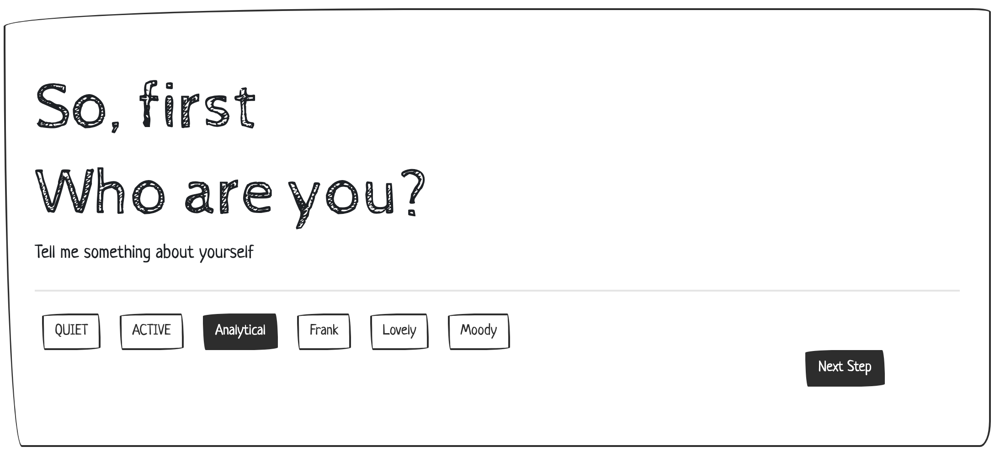

# jourme

Travel recommendation server
# Inspiration
Jourme -- My Journey Though there are so many different websites for booking hotels and recommending restaurants. Few are designed for a detailed plan of the trip based on personal preference. So we want to collect the information of users to produce specific trip plan for every user.

# What it does
A website to recommend detailed attractions and restaurant plans based on the user's preference.

We collect user's hobbies and characters through different tags and then matching the characteristics of attractions and restaurants.

# How we built it
Front end: node.js bootstrap

Back end: express.js MongoDB Google Cloud Platform

Map API: Google map API, Yelp API

# Challenges we ran into
The classification algorithm used to pick best choice for users could be optimized.

Accomplishments that we're proud of
Front and Back End is nicely built with beautiful UI.

Design this product with excellent idea

# What we learned
Explore different platforms like Express.js MongoDB and GCP.

Brainstorm the possibilities to create something new

# What's next for Jourme
Try different algorithms and datasets to train the model

Add AR scene for those attractions

Expand products to Mobile platforms.

Built With

GCP 

#backend
`gcloud compute --project "travelyyhvv01" ssh --zone us-central1-a frontend`

[blossom] for ssh

#frontend
`gcloud compute --project "travelyyhvv01" ssh --zone us-central1-a fin`

`npm install`

`sed -i -e 's/8080/80/g' app.js`

`sudo node app --be_ip 10.128.0.2 --fe_ip 10.128.0.3 &`

----------------

# DEMO

* TreeHacks 2020

* [JOURME]: https://devpost.com/software/jourme

* [http://35.222.19.107/]: http://35.222.19.107/

  ​

